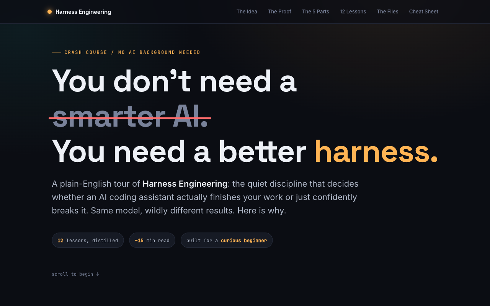

# Harness Engineering, Explained Visually

An interactive, single-page crash course that turns a dense 12-lecture curriculum on **harness engineering** into something you can grasp in about 15 minutes, even with zero AI background.

**▶ Live demo: https://rohitjz.github.io/harness-engineering-crash-course/**



## The idea in one line

AI coding agents usually fail not because the model is too dumb, but because the environment around it (the "harness") is badly built. This page makes that case visually, then walks through the fixes.

## What's inside

- A 5-word primer that gets a non-technical reader fluent enough to follow along
- An interactive before/after toggle: same model, same prompt, going from "$9, broken" to "$200, shippable"
- A clickable diagram of the five harness subsystems
- A stepper that animates one model climbing from 20% to 100% reliability as harness pieces are added
- All 12 lessons as tap-to-open cards: the failure, the fix, and a plain-English analogy for each
- Two playable failure modes (the overreach spiral, and a completion gate that catches an agent faking "done")
- The real config files (`AGENTS.md`, `feature_list.json`, ...) in a tabbed code viewer

## Why I built it

I wanted to test whether a hard, systems-level engineering topic could be made genuinely intuitive without dumbing it down. Self-imposed constraint: one self-contained HTML file, no frameworks, no build step, teaching through interaction instead of walls of text.

## Tech

- One file. Vanilla HTML, CSS, JavaScript. No dependencies, no build step.
- Responsive to mobile. Scroll-triggered reveals, animated counters, all hand-rolled.
- About 64KB, loads instantly, works offline.

## Run it locally

Just open `index.html` in a browser. Or serve it:

```bash
python3 -m http.server 8000
# then visit http://localhost:8000
```

## Credit and honesty note

Source material is the open [Learn Harness Engineering](https://walkinglabs.github.io/learn-harness-engineering/en/) course by walkinglabs, which itself draws on published work from OpenAI and Anthropic. This is my visual explainer of that material, not the original research. The specific figures shown ($9 vs $200, 20% to 100%, etc.) are the course's own illustrative cases, not independently verified benchmarks.

## License

[MIT](LICENSE) for the code and design in this repository.
